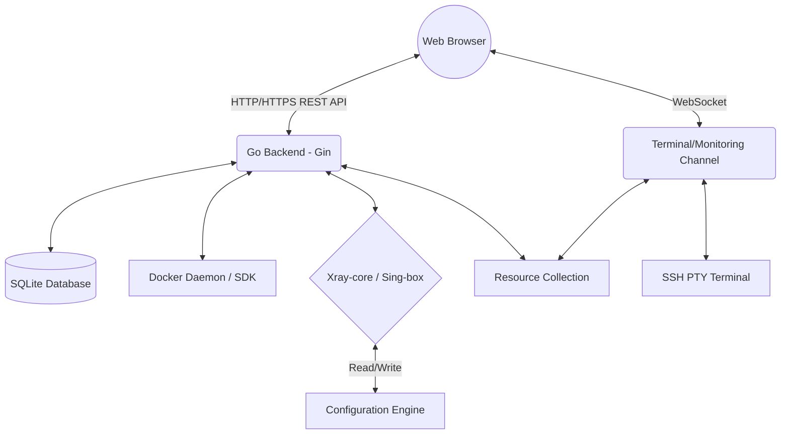

# ZenithPanel Design Document

[简体中文](design_document_CN.md) | English

## 1. Overview

ZenithPanel aims to merge "daily server maintenance" and "advanced proxy orchestration" into a single control panel. Optimized for low resource consumption (ideal for cheap VPS), it provides an intuitive, modern, and secure interactive experience.

---

## 2. Architecture Design

ZenithPanel follows a **Separated Frontend and Backend + All-in-One Binary** design philosophy.

### 2.1 Deployment
- **Single Binary Execution**: Frontend static assets (built with Vue) are bundled into the Go backend binary using `go:embed`. Users can deploy without configuring complex Nginx+Node environments.
- **Unified Data Directory (`zenith-data/`)**: All state information—SQLite database, proxy configurations, logs, app store settings, and TLS certificates—is contained in one directory for easy backup and migration.

### 2.2 Core Module Interaction Topology

---

## 3. Core Modules

### 3.1 User & Permission System
- **Security Setup Wizard**:
  - **Install State**: On first launch, the panel generates a high-strength random password and a **random initial Web entrance** (e.g., `/zenith-setup-8f2a`). It prints these to the terminal for one-time administrator access.
  - **Mandatory Wizard**: After logging in via the initial random entry, the administrator must: 1) Set a custom strong password, 2) Define a custom security path, and 3) (Optional) Enable 2FA. Once completed, the initial random credentials expire.
- **Authentication**: Uses `JWT (JSON Web Token)` with a secret key generated randomly during first launch and persisted in the database.
- **Enhanced Security**:
  - Supports Google Authenticator (TOTP) for 2FA.
  - Built-in IP whitelisting and rate limiting for unauthorized requests.

### 3.2 Proxy Core Engine
Unlike panels that directly manipulate JSON fragments, ZenithPanel introduces a **Declarative Configuration Management Layer**:
- **Unified Metadata**: The database stores abstract node data rather than raw JSON snippets.
- **Template Rendering**: The backend uses Go's `text/template` to **dynamically render** full Xray-core / Sing-box config files based on database records.
- **Graceful Reload**: Triggers a hot-reload of configurations via system signals or commands without dropping existing connections.

### 3.3 Container Management
- **Underlying Communication**: Integrates the official `docker/docker/client` SDK, communicating with the Docker daemon via Unix Socket (`/var/run/docker.sock`).
- **App Store Abstraction**: Parses an external repository to dynamically render `docker-compose.yml` files, allowing one-click deployment of apps like WordPress or MySQL.

### 3.4 Monitoring & Web Terminal
- **Resource Collection**: Uses `shirou/gopsutil` for cross-platform data collection (CPU, RAM, Disk I/O).
- **SSH Terminal**: Implements a native SSH client that connects to the local host via `golang.org/x/crypto/ssh` to provide a PTY, forwarded to the frontend's `xterm.js` via WebSocket.
- **Network Diagnostics**: Integrates a `vps_check.sh` script to test connectivity for streaming (Netflix/YouTube) and AI platforms (ChatGPT/Claude) using simulated browser User-Agents.

### 3.5 Deployment Pipelines
A `bash` based installer (`install.sh`) handles:
- **Dependency Installation**: Detects OS and installs pre-requisites like curl, jq, and Docker.
- **Firewall Configuration**: Automatically configures UFW/firewalld for necessary ports.
- **Daemonization**: Registers ZenithPanel as a `systemd` service with auto-restart on failure.

---

## 4. Database Schema

Uses SQLite for lightweight persistence. Core tables include:
- `users`: Admin account credentials and 2FA secrets.
- `proxy_inbounds`: Inbound protocols, ports, and TLS settings.
- `proxy_outbounds`: Destination outbound nodes.
- `proxy_rules`: Routing rules for direct, block, or proxy traffic.
- `proxy_clients`: User quotas and expiration dates.
- `system_settings`: Panel-wide configuration.

---

## 5. Security Principles

- **Least Privilege**: Proxies (Xray/Sing-box) run as non-root users (e.g., `nobody`).
- **Safe Supply Chain**: All third-party packages are version-locked in `go.mod` and `package-lock.json`.
- **Privacy Sandbox**: Stack traces are hidden in production; API returns standardized error codes.
