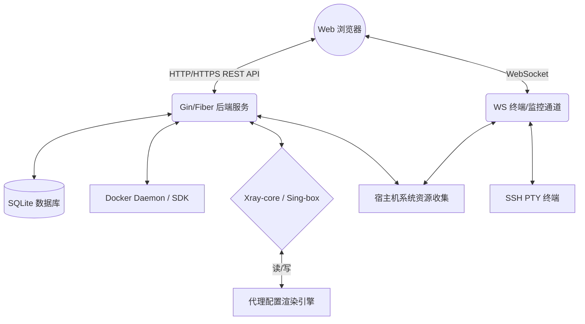

# ZenithPanel 详细设计文档 (Design Document)

简体中文 | [English](design_document.md)

## 1. 概述 (Overview)

ZenithPanel 旨在将现代化服务器的“日常运维管理”与“高级代理服务编排”融合在同一个控制面板中。通过高度优化的架构设计，实现极低资源占用（适用于廉价 VPS），同时提供直观、现代、安全的交互体验。

---

## 2. 系统架构设计 (Architecture Design)

ZenithPanel 采用 **All-in-One 单体应用架构 + 前后端分离** 的设计理念。

### 2.1 部署架构
- **单文件二进制运行**: 将包含 Vue 构建产物的前端静态资源，通过 Go 1.16+ 的 `go:embed` 技术打包进后端的同一个二进制可执行文件中。用户无需配置复杂的 Nginx+PHP 或 Nginx+Node 环境，开箱即用。
- **统一数据目录 (`zenith-data/`)**: 面板产生的所有状态信息，包括 SQLite 数据库、Xray/Sing-box 核心配置、系统日志、应用商店持久化配置、自动申请的 TLS 证书等，全部收敛于一个目录，便于备份和迁移。

### 2.2 核心模块交互拓扑

---

## 3. 核心功能模块设计 (Core Modules)

### 3.1 用户与权限系统层
- **初始化与向导防线 (Setup Wizard)**: 
  - **安装态**: 控制面板在第一次安装启动时，绝不预设“admin/admin”之类的默认弱密码。而是在宿主机的终端（Terminal）自动生成一串高强度随机密码以及**随机的初始 Web 访问入口** (例如 `/zenith-setup-8f2a`)，将其打印在屏幕上供管理员第一次也是唯一一次使用。
  - **强制向导**: 使用该初始随机参数成功登录 Web 后，系统会被拦截进入**强制 Setup Wizard向导**。向导中，管理员必须：1) 设置自定义的强密码，2) 自定义面板的安全入口路径，3) (可选) 绑定 2FA，4) (可选) 更改默认的 SSH 端口以防扫。一旦走完这个流程，最初始的随机密码与随机入口立即作废。
- **鉴权机制**: 使用基于强密钥串的 `JWT (JSON Web Token)`。密钥在首次启动时随机生成，持久化在数据库中，避免默认密钥导致的安全隐患。
- **增强安全**: 
  - 支持绑定 Google Authenticator 生成 2FA 动态密码（两步验证）。
  - 内置 IP 白名单及异常 IP 封锁控制。暂未登录的非法请求限制速率 (Rate Limiting)。
  - 面板 API 请求均要求带有时效性 Token 和基础防 CSRF 的随机校验值。

### 3.2 代理引擎调度 (Proxy Core Engine)
现有的代理面板往往是界面通过接口去零散地修改 `config.json`，在多核心或者多出/入站配置下极易出错。ZenithPanel 引入了**声明式的配置管理层**：
- **统一节点元数据**: 数据库中仅记录”这是一个 VLESS 节点”或者”该节点目标是香港节点B”，而不直接保存原生 JSON 碎片。
- **模板渲染机制**: 面板后端将数据库中的各类节点信息、路由规则信息汇聚后，利用 Go 的 `text/template` 生态，**动态渲染** 出完整的 Xray-core / Sing-box 配置文件。
- **无缝平滑重载**: 配置文件渲染并写入磁盘后，通过执行对应的核心命令 (或发送 SIGHUP 信号) 触发重载，不中断其他正常连接。
- **快速配置向导 (Quick Setup Wizard)**: 一键式节点配置系统，内置 6 种预设协议方案（VLESS+Reality、VLESS+WS+TLS、VMess+WS+TLS、Trojan+TLS、Hysteria2、Shadowsocks）。后端提供 `POST /api/v1/proxy/generate-reality-keys` 接口，使用 Go `crypto/ecdh` 生成 X25519 密钥对。所有加密素材（密钥、Short ID、密码、WebSocket 路径）均自动生成，管理员可在确认步骤中进行完全自定义调整。

### 3.3 容器管家与应用市场层 (Container Management)
- **底层通信**: Go 后端集成官方 `docker/docker/client` SDK，直接通过 Unix Socket (`/var/run/docker.sock`) 与 Docker deamon 交互。这样无需暴露 2375 端口，保证安全。
- **应用市场抽象**: 通过解析外部配置仓库（例如维护一个 GitHub 仓库的 `apps.json` 和目录结构），动态渲染 `docker-compose.yml` 并调用容器 API 拉起应用。用户端只需进行简单的表单填空即可部署 WordPress、MySQL 等容器。

### 3.4 节点系统监控与 Web 终端层
- **资源采集**: 采用 `shirou/gopsutil` 等库跨平台收集 CPU(单核/多核负载)、内存使用率、磁盘分区占用率和 IO 上下行速率。
- **SSH 终端**: 内置 Web 终端，基于 `golang.org/x/crypto/ssh` 实现一个本机的 SSH 客户端连接自己获取 PTY 终端设备，然后将 PTY 的 I/O 流通过 WebSocket 转发给前端的 `xterm.js`。
- **网络综合体检 (Network Diagnostics)**: 后端集成一键执行环境下的 `vps_check.sh` 脚本，该脚本具备浏览器拟真 UA (突破 Cloudflare 无头审查)，通过 `curl` 针对原生 IP 直连质量、流媒体平台（Netflix/YouTube）及各大 AI 平台（Claude/ChatGPT）进行可用性、延迟与限流状态侦测，并将结果格式化流发送给前端展示。

### 3.5 系统自动化装配与部署脚本 (Deployment Scripts)
采用 `bash` 编写一键自动安装流水线 (`install.sh`)，其承担以下任务：
- **依赖预装**: 探测系统类型并预装 curl, wget, jq, docker(如需容器环境) 等基础工具。
- **防火墙穿透**: 自动探测系统防墙（UFW, firewalld, iptables），并放行控制面板自身依赖的基础端口。
- **守护进程化**: 将下载的独立的 ZenithPanel 二进制文件自动注册为 `systemd` 服务，确保异常崩溃自动重启与开机自启。 

---

## 4. 数据库设计 (Database Schema Conceptual)

使用 SQLite 由于其无需依赖外部服务的高效和轻量。核心基础表：

1. `users` - 管理员账户信息（哈希密码、2FA秘钥、最后登录IP等）
2. `proxy_inbounds` - 多协议入站配置表（监听端口、UUID、协议类型、TLS设置）
3. `proxy_outbounds` - 出站路由目标节点列表
4. `proxy_rules` - 路由网关规则表（直连流量、拦截流量、代理流量匹配）
5. `proxy_clients` - 代理服务订阅用户层级（配额、到期时间、独立 UUID）
6. `system_settings` - 面板基本系统配置（端口、域名、证书路径）

---

## 5. 项目安全性原则 (Security Guidelines)

- **最小权限运行**: 对于代理核心（Xray/Sing-box），面板在启动它们时应该降低权限，以特定的 `nobody` 或 `proxyuser` 身份运行，拒绝给其分配 root 权限。
- **防止后门**: 所有引入的第三方包须严格经过安全扫描并且锁定版本号 (`go.sum` / `package-lock.json`)。
- **隐私沙盒**: 除非开启开发者模式，所有的堆栈报错都不会在前端被打印出来，API 只返回标准化包装的错误格式（如 `{"code": 500, "msg": "Internal Server Error"}`）。
